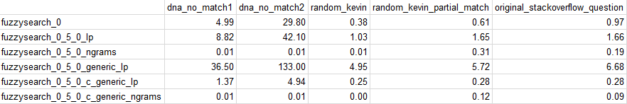

# Playing with Cython

### PyWeb-IL #71 -- Dec. 2017

<div style="text-align:center">
Tal Einat -- taleinat
</div>

Note:
- Not an intro to Cython
- I'm not a Cython expert
- Cython has tons of amazing features I won't mention

---

## What is Cython?
### Wikipedia

> "Cython is **a superset of the Python programming language**, designed to give
**C-like performance** with code which is mostly written in Python."

VVV

## What is Cython?
### Cython.org

> "Cython is **an optimising static compiler** for both the Python programming
> language and the extended Cython programming language (based on Pyrex).
> **It makes writing C extensions for Python as easy as Python itself.**"

VVV

## What is Cython?

- A superset of Python
- Easily integrate C and Python code

---

## What is it good for?

- <!-- .element: class="fragment" --> Optimizations
- <!-- .element: class="fragment" --> Using things available only in C
  - OS functionality
  - Custom C code
  - 3rd party C libraries
- <!-- .element: class="fragment" --> Testing C code with Python test libraries
- <!-- .element: class="fragment" --> ...

Note: mention scandir, copyfile

---

## What does it look like?

```cython
def fib(int n):
    cdef int i
    cdef int a=0, b=1
    for i in range(n):
        a, b = a + b, a
    return a
```

Note:

- I had to create a cython theme for highlight.js
- Cython optimizes for loops

---

## Compilation? AAARGH! -- Development

- Need to have a C compiler installed
- Need Cython (`pip install cython`)
  - Works on all common platforms
  
Some options:

- `pyximport` magically imports from Python, compiling if needed
- `cythonize -i fib.pyx` compiles in-place
- `cython fib.pyx` -> `fib.c` and then compile...
- `setup.py build_ext --inplace`

VVV

## Compilation? AAARGH! -- Users

- Binary wheels! `pip install` just works.
  - Automated generation: Still a PITA.
- With a C compiler and relevant Python sources, `pip install` can build the
  extensions from source.
- Best practice: Don't require Cython to *install*.
  - Include generated `.c` files in the source dist.
- When used for optimization, having pure-Python fallbacks can allow
  installation to *always* "just work".

---

## My journey begins...

Stack Overflow: "Get position of subsequence using Levenshtein-Distance"

> "I have a huge number of records containing sequences
> ('ATCGTGTGCATCAGTTTCGA...'), up to 500 characters. I also have a list of
> smaller sequences, usually 10-20 characters. I would like to use the
> Levenshtein distance in order to find these smaller sequences inside the
> records allowing for small changes or indels (L_distance <=2)."

VVV

## My journey begins...

- People suggest using
  `difflib.SequenceMatcher`, but that's not what is wanted.
- Naive solution:
  `min(lev_dist(subseq, seq[i:]) for i in range(len(seq)))`
  - very slow; O(n·k²) complexity
- Can't find a *good* solution anywhere!
- Nobody on SO suggests an existing solution...
- (More options today, e.g. `regex`, `alignment`)

VVV

## My journey begins...

- This sounds like fun!
- I post an initial implementation as an answer.
- I begin emailing with the poster, it turns out he's running this on TONS of
  data, and my solution is still too slow.
- Optimization!

---

## The Levenshtein Distance

<div style="text-align:center">


</div>

Note:
- canonical linear programming algorithm

VVV

<div style="text-align:center">

</div>

---

## My Fuzzy Search Algorithm

-   Conceptually equivalent to running the original algorithm once at
    each index of the searched sequence.
-   Several essential changes reduce complexity and make it much faster
    than the naive approach.

---

### Change #1: <br> Calculate only the relevant part of the grid

<div style="text-align:center">

</div>

Note:
- More significant with smaller max. L distance and/or longer patterns

---

### Change #2: Stop calculating when the distance is too large

<div style="text-align:center">

</div>

Note:
- Includes change #1 inherently
- Also more significant with smaller max. L distance and/or longer patterns

---

### Change #3: Candidates

Pros:

-   Single pass over the searched sequence
-   Implementing change #2 is a simple "if"
-   Allows keeping track of the "paths"
-   A good basis for more generic distance metrics

Cons:

-   Keeping a potentially large number of objects in memory
-   Larger number of overlapping matches to deal with

Note:

-   "Candidates" is a term I made up
-   Reversed direction of computation

VVV

### Paths

<div style="text-align:center">


</div>

Note:
- This is important for supplying a best match rather than just
  the distance between two strings.

VVV

### Backward vs. Forward Grid Cell Calculation

<div style="text-align:center">


</div>

Note:
- Backward is more straightforward to implement due to the nature of
  the Levenshtein distance metric.

---

## "Python is slow!"

-   "Lies, damned lies and statistics"
-   However, string searching algorithms are specifically of the types of tasks
    for which Python actually is rather slow.

Benchmarks:

<div style="text-align:center">

</div>

<small>
\* _Dell XPS 15 9560; Intel i7-7700hq; Windows 10; Python 3.6.3; Cython 0.27.3_
<br>
\*\* _Results are in milliseconds._
</small>

---

## Iterative Optimization
### Tal's 10 Steps to an Optimized You

1.  Write straightforward, correct code.
2.  Write a comprehensive enough test suite.
3.  Profile with a realistic workload.
4.  Optimize the slowest part.
5.  Repeat steps 3-4 as necessary.

Note:
- Cython is exceptionally great at this.

---

## Optimization #1: <br> Just Compile with Cython!

- Cython is an *optimizing* compiler, after all.
- Usually just works.
- Benefits can be surprising.

---

## Optimization #2: Loop Variables

- `cdef int` or `cdef size_t`
- `for i in range(n_iterations): ...`

Note:
- Cython does "automatic range conversion"

---

## Optimization #3: Structs

- C structs are useful and blazing fast

```cython
cdef struct GenericSearchCandidate:
    int start, subseq_index, l_dist, n_subs, n_ins, n_dels

cdef GenericSearchCandidate[1000] candidates

n_candidates = 0
for seq_char in sequence[:seq_len]:
    candidates[n_candidates] = GenericSearchCandidate(index, 0,
                                                      0, 0, 0, 0)
    n_candidates += 1
```

---

## Optimization #4: Memory Mgmt.

```cython
cdef GenericSearchCandidate* candidates

alloc_size = min(10, subseq_len * 3 + 1)
candidates = <GenericSearchCandidate *> malloc(
    alloc_size * sizeof(GenericSearchCandidate))
if candidates is NULL: raise MemoryError()

for ...:
    if n_new_candidates + 4 > alloc_size:
        alloc_size *= 2
        _tmp = <GenericSearchCandidate *>realloc(new_candidates,
            alloc_size * sizeof(GenericSearchCandidate))
        if _tmp is NULL: raise MemoryError()
        new_candidates = _tmp
        
free(candidates)
```

---

## Optimization #5: N-grams

1.  Split the pattern into minimal-length pieces
2.  Search for exact matches of any piece
3.  Try to "expand" the match in both directions
    -   Expansion is done similarly to the original LP algo

VVV

## Optimization #5: N-grams

-   A very different algorithm!
    -   Zooming way out to the highest level can be a great optimization strategy.
-   Exact sub-string search is a much simpler problem
    -   O(n·k) worst case; O(n) or better on reasonable inputs
-   Exact sub-string search is a *solved problem*
    -   `str.find()`

VVV

## Optimization #5: N-grams

-   Problem: The N-grams method is only good when the minimal-length
    exactly matching pieces are large enough.
-   I already have a generic solution which is a good fallback.
-   Solution: Supply both, as well as a `find_near_matches()`
    function which chooses the best approach for the given input.

---

## Benchmarks

<div style="text-align:center">

</div>

<small>
\* _Dell XPS 15 9560; Intel i7-7700hq; Windows 10; Python 3.6.3; Cython 0.27.3_
<br>
\*\* _Results are in milliseconds._
</small>

VVV

## Benchmarks

<div style="text-align:center">

</div>

-   The N-grams implementations are *much* faster than the rest
    -   1-3 orders of magnitude
-   The "generic" LP implementation is 2x-4x times slower than the
    non-"generic" (Levenshtein distance only) version
-   ... but the Cython "generic" implementation is 4x-10x *faster*

VVV

## Benchmarks -- N-grams Comparison

<div style="text-align:center">

</div>

<small>
\* _Results are in **micro**seconds._
</small>

-   The "generic" Cython version is consistently faster
    -   up to 3x faster
-   A non-"generic" Cython implementation could be even faster
-   ... but at this point there was no need for further optimization!

VVV

## Benchmarks
### Cython "Generic" N-grams vs. Original

<div style="text-align:center">

</div>

-   I had achieved an improvement of between 10x and 3,000x, depending on
    the benchmark used.
-   This while allowing more fine-grained distance metrics.

---

## Final Remarks on Fuzzysearch

-   I also spent (too many) hours getting the library into good shape:
    -   Automated testing on Travis-CI and AppVeyor
    -   Testing on different Python versions via tox
    -   Test coverage reporting via coverage and coveralls
    -   Building binary wheels for Windows and OSX (not automated)
    -   Pure-Python fallbacks when installing from source and building
        native extensions fails.
-   So just `pip install fuzzysearch`!

---

<!-- .element: class="auto-fragment" -->

## Final Remarks

-   I learned a lot!
    -   I also wrote some functions in C using the Python C API.
    -   Cython was a great way to learn about that.
-   I had fun!
-   I have a nice open-source library to my name!
    -   ... which nobody is using (because I didn't bother with PR)

---

# Questions?
